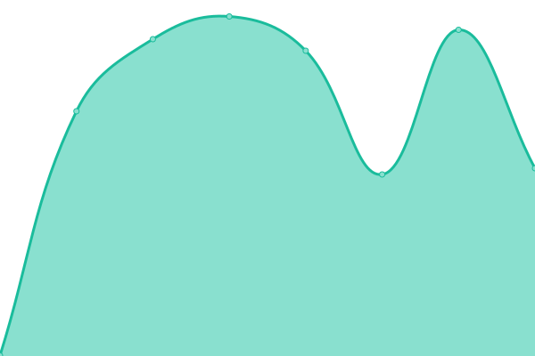

# [📈 Live Status](https://uptime.danielpetrica.com): <!--live status--> **🟩 All systems operational**

This repository contains the open-source uptime monitor and status page for [Petrica Andrei-Daniel](https://danielpetrica.com), powered by [Upptime](https://github.com/upptime/upptime).

With [Upptime](https://upptime.js.org), you can get your own unlimited and free uptime monitor and status page, powered entirely by a GitHub repository. We use [Issues](https://github.com/danielpetrica/upptime/issues) as incident reports, [Actions](https://github.com/danielpetrica/upptime/actions) as uptime monitors, and [Pages](https://uptime.danielpetrica.com) for the status page.

<!--start: status pages-->
<!-- This summary is generated by Upptime (https://github.com/upptime/upptime) -->
<!-- Do not edit this manually, your changes will be overwritten -->
<!-- prettier-ignore -->
| URL | Status | History | Response Time | Uptime |
| --- | ------ | ------- | ------------- | ------ |
|  [Danielpetrica.com](https://danielpetrica.com) | 🟩 Up | [danielpetrica-com.yml](https://github.com/danielpetrica/uptime/commits/HEAD/history/danielpetrica-com.yml) | 

 95ms
     
 | 

<a href="https://uptime.danielpetrica.com/history/danielpetrica-com">100.00%</a>
    

|  [Strapi](https://strapi.padserver.xyz/) | 🟩 Up | [strapi.yml](https://github.com/danielpetrica/uptime/commits/HEAD/history/strapi.yml) | 

 471ms
     
 | 

<a href="https://uptime.danielpetrica.com/history/strapi">100.00%</a>
    

|  [UnioneUniversitaria.it](https://www.unioneuniversitaria.it) | 🟩 Up | [unione-universitaria-it.yml](https://github.com/danielpetrica/uptime/commits/HEAD/history/unione-universitaria-it.yml) | 

 1513ms
     
 | 

<a href="https://uptime.danielpetrica.com/history/unione-universitaria-it">100.00%</a>
    

|  [LoStrilloneUniversitario.it](https://www.lostrilloneuniversitario.it/) | 🟩 Up | [lo-strillone-universitario-it.yml](https://github.com/danielpetrica/uptime/commits/HEAD/history/lo-strillone-universitario-it.yml) | 

 1933ms
     
 | 

<a href="https://uptime.danielpetrica.com/history/lo-strillone-universitario-it">100.00%</a>
    

|  H24 | 🟩 Up | [h24.yml](https://github.com/danielpetrica/uptime/commits/HEAD/history/h24.yml) | 

 425ms
     
 | 

<a href="https://uptime.danielpetrica.com/history/h24">100.00%</a>
    

|  Reggio | 🟩 Up | [reggio.yml](https://github.com/danielpetrica/uptime/commits/HEAD/history/reggio.yml) | 

 914ms
     
 | 

<a href="https://uptime.danielpetrica.com/history/reggio">100.00%</a>
    

<!--end: status pages-->

[**Visit our status website →**](https://uptime.danielpetrica.com)

## 📄 License

- Powered by: [Upptime](https://github.com/upptime/upptime)
- Code: [MIT](./LICENSE) © [Petrica Andrei-Daniel](https://danielpetrica.com)
- Data in the `./history` directory: [Open Database License](https://opendatacommons.org/licenses/odbl/1-0/)
